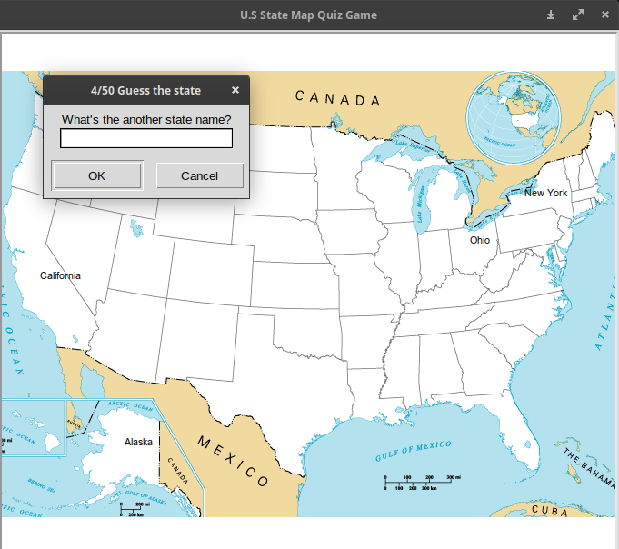

# U.S States Map Game

## Overview

This is a simple educational game that helps you learn the names and locations of U.S states. The game uses the `turtle` library for graphics and `pandas` for handling the data.

## Features

- A U.S map will be displayed using the turtle graphics.
- A popup window will ask to enter the name of a U.S state.
- If the entered state name is correct, it will be placed at the right location on the map.
- At the end of the game, the number of state names entered correctly will be counted.
- A CSV file will be generated containing the remaining states for educational purposes.

## Installation

Make sure you have Python installed on your system.
  ```bash
  pip install pandas
```
## How to Play

1. Clone the repository:

   ```bash
   git clone https://github.com/kcvaghasiya/us-states-game.git

2. Change into the project directory:
   
   ```bash
   cd us-states-game
   
3. Run the game:

   ```bash
   python main.py



## Dependensies

- Python 3.x
- Pandas
- Turtle

## File Structure

main.py: Main Python script for the game.
us-states-game.csv: CSV file containing U.S state names and coordinates.
